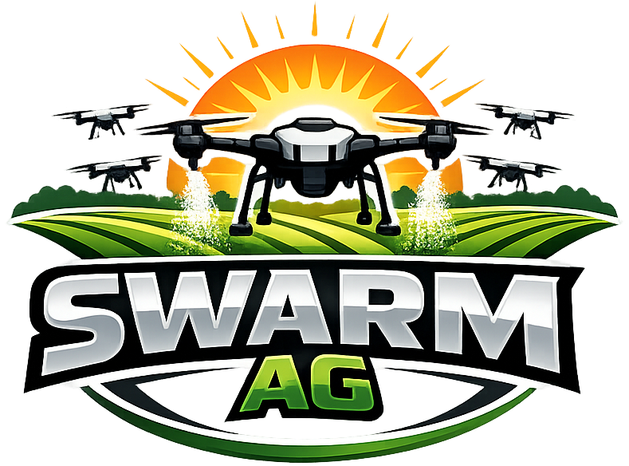

# swarmAg Operations System -- README



The swarmAg Operations System (`swarmAg system`) supports operations across aerial and ground agricultural services. The monorepo is organized around a typed domain core, backend/runtime infrastructure, and user experience applications.

Primary architectural context lives in `documentation/foundation/architecture-core.md`.

## 1. Repository Structure

### 1.1 Top-level Namespaces

| Path             | Description                                              |
| ---------------- | -------------------------------------------------------- |
| `deploy/`        | Deployment artifacts and environment-specific output     |
| `documentation/` | Product, architecture, domain, and history documentation |
| `source/`        | Application and platform implementation code             |
| `supabase/`      | Supabase project configuration and local metadata        |

### 1.2 Documentation (`documentation\`)

| Path            | Description                                                   |
| --------------- | ------------------------------------------------------------- |
| `applications/` | Application-level requirements and UX/product specs           |
| `foundation/`   | Core architecture, domain, style, and data definitions        |
| `archive/`      | Historical architecture notes and project evolution artifacts |

#### 1.2.1 Foundation (`documentation/foundation/`)

| Path                   | Description                                            |
| ---------------------- | ------------------------------------------------------ |
| `architecture-core.md` | Core architecture principles and system-wide structure |
| `architecture-back.md` | Backend architecture, boundaries, and runtime model    |
| `architecture-ux.md`   | UX architecture and frontend layering                  |
| `domain.md`            | Domain model concepts, entities, and invariants        |
| `data-lists.md`        | Controlled vocabularies and enumerated values          |
| `style-guide.md`       | Style and authoring conventions                        |

#### 1.2.2 Applications (`documentation/applications/`)

| Path                 | Description                                        |
| -------------------- | -------------------------------------------------- |
| `user-stories.md`    | Cross-application user stories and workflow goals  |
| `admin-web-app.md`   | Administration app scope and requirements          |
| `ops-mobile-app.md`  | Operations mobile app scope and field workflows    |
| `customer-portal.md` | Customer portal scope, visibility, and constraints |

### 1.3 Source Layers (`source/`)

| Path      | Description                                                       |
| --------- | ----------------------------------------------------------------- |
| `back/`   | Backend runtime modules (config, functions, library, migrations)  |
| `core/`   | Fundamental types and utilities used by all layers                |
| `devops/` | Architecture and environment guard scripts                        |
| `domain/` | Domain model and domain-layer contracts                           |
| `tests/`  | Test suites and supporting fixtures                               |
| `ux/`     | Client-facing user experiences, apps, contracts, and UI libraries |

### 1.3.1 Core (`source/core/`)

| Path       | Description                                      |
| ---------- | ------------------------------------------------ |
| `api/`     | API binding facilities for REST, HTTP & RDBMS    |
| `db/`      | Database provider and connection management      |
| `runtime/` | Configuration facilities and available providers |
| `std/`     | ADT's, When & ID                                 |

#### 1.3.2 Domain (`source/domain/`)

| Path            | Description                                    |
| --------------- | ---------------------------------------------- |
| `abstractions/` | Core domain abstractions                       |
| `adapters/`     | Domain adapters and boundary translation logic |
| `protocol/`     | Domain protocols and interface contracts       |
| `validators/`   | Domain validation logic and invariants         |

#### 1.3.3 Backend (`source/back/`)

| Path             | Description                                       |
| ---------------- | ------------------------------------------------- |
| `migrations/`    | SQL migration files for backend persistence setup |
| `supabase-edge/` | Serverless/edge function entry points             |

#### 1.3.4 User Experience (`source/ux/`)

| Path            | Description                     |
| --------------- | ------------------------------- |
| `api/`          | UX API client into the backend  |
| `app-admin/`    | Administration application code |
| `app-customer/` | Customer application code       |
| `app-common/`   | Common application code         |
| `app-config/`   | Config provider for all apps    |

## 2. Local Configuration

The system uses environment-based configuration with runtime detection. UX applications share a single configuration module that is packaged with each app deployment, similar to how `core` and `domain` modules are packaged.

### 2.1 Backend Configuration

Backend edge functions require Supabase connection credentials:
```bash
# Create local backend config from example
cp source/back/supabase-edge/config/back-local.env.example source/back/supabase-edge/config/back-local.env
```

Required variables:
```dotenv
# source/back/supabase-edge/config/back-local.env
SUPABASE_URL=http://localhost:54321
SUPABASE_SERVICE_KEY=your-service-role-key
SUPABASE_ANON_KEY=your-anon-key
JWT_SECRET=your-jwt-secret
```

### 2.2 UX Configuration

All UX applications share a single configuration module (`source/ux/config/ux-config.ts`) that is packaged with each app deployment.
```bash
# Create shared UX config from example
cp source/ux/config/ux-local.env.example source/ux/config/ux-local.env
```

Required variables:
```dotenv
# source/ux/config/ux-local.env
VITE_SUPABASE_EDGE_URL=http://localhost:54321/functions/v1
VITE_SUPABASE_URL=http://localhost:54321
VITE_SUPABASE_SERVICE_KEY=your-service-role-key
VITE_JWT_SECRET=your-jwt-secret
```

UX applications connect directly to Supabase via Row Level Security policies. The shared config module is bundled with each application during deployment, just as the `core` and `domain` layers are.

### 2.3 Configuration Rules

- **Never commit actual `.env` files** - only commit `.env.example` files
- Local configs are gitignored via `**/*-local.env` pattern
- Stage and prod configs follow same pattern: `*-stage.env`, `*-prod.env`
- All runtime config values are validated at bootstrap via `Config.init()`
- Shared modules (`core`, `domain`, `ux/config`) are packaged with consuming applications

## 3. Project Commands

```bash
# Full checks (guards + typecheck + lint)
deno task check

# Tests
deno task test

# Lint + markdown lint
deno task lint

# Format and format-check
deno task fmt
deno task fmt:check
```

## 4. Working Rules

| Rule              | Description                                                                                                                                                           |
| ----------------- | --------------------------------------------------------------------------------------------------------------------------------------------------------------------- |
| `CONSTITUTION.md` | Governing authority for all human and AI contributions. Apply conservative changes, respect architecture guards, and escalate when intent or constraints are unclear. |
| `README.md`       | Starting point for understanding the project. Keep it up-to-date and accurate.                                                                                        |
| `cspell.json`     | Spell checker configuration. Keep it up-to-date and accurate.                                                                                                         |
| `dprint.json`     | Code formatter configuration. Keep it up-to-date and accurate.                                                                                                        |
| `deno.json`       | Deno project configuration. Keep it up-to-date and accurate.                                                                                                          |
