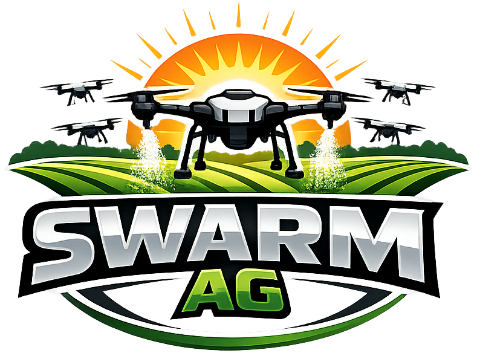

# swarmAg Operations System — Data Dictionary

## 1. Overview

This document is the normalized reference for domain abstraction types, relations, and state attributes.

It is derived from `domain.md` and presents the same model in a table-first, implementation-ready format for use in topic artifact productions -- Abstractions -- and the archetypes -- Adapters, Protocols, Validators and Schema -- that are tightly coupled to them.

The `domain.md` and `data-dictionary.md` go hand-in-hand in mapping a conceptual solution space to physical artifacts that codify the solution as software.

## 2. Topic Namespace

| Topic     | Source                             | Contents                 |
| --------- | ---------------------------------- | ------------------------ |
| Common    | `@domain/abstractions/common.ts`   | Location                 |
|           |                                    | Attachment               |
|           |                                    | Note                     |
|           |                                    | QuestionType             |
|           |                                    | BaseQuestion             |
|           |                                    | InternalQuestion         |
|           |                                    | ScalarQuestion           |
|           |                                    | SelectOption             |
|           |                                    | SelectQuestion           |
|           |                                    | Question                 |
|           |                                    | Answer                   |
| Assets    | `@domain/abstractions/asset.ts`    | AssetType                |
|           |                                    | AssetStatus              |
|           |                                    | Asset                    |
| Chemicals | `@domain/abstractions/chemical.ts` | ChemicalUsage            |
|           |                                    | ChemicalLabel            |
|           |                                    | Chemical                 |
| Customers | `@domain/abstractions/customer.ts` | Contact                  |
|           |                                    | CustomerSite             |
|           |                                    | Customer                 |
| Services  | `@domain/abstractions/service.ts`  | ServiceCategory          |
|           |                                    | Service                  |
|           |                                    | ServiceRequiredAssetType |
| Users     | `@domain/abstractions/user.ts`     | UserRole                 |
|           |                                    | User                     |
| Workflows | `@domain/abstractions/workflow.ts` | Task                     |
|           |                                    | TaskQuestion             |
|           |                                    | Workflow                 |
|           |                                    | WorkflowTask             |
| Jobs      | `@domain/abstractions/job.ts`      | JobStatus                |
|           |                                    | Job                      |
|           |                                    | JobAssessment            |
|           |                                    | JobWorkflow              |
|           |                                    | JobPlan                  |
|           |                                    | JobPlanAssignment        |
|           |                                    | JobPlanChemical          |
|           |                                    | JobPlanAsset             |
|           |                                    | JobWork                  |
|           |                                    | JobWorkLogEntry          |

## 3. Core Standard

Source: `@core-std`

### 3.1 Instantiable

Purpose: **Lifecycle base for all persisted abstractions with independent database rows; extend via intersection — do not redeclare these fields inline**

Type: **type**

Attributes: **State**

| **Attribute** | **Type** |
| ------------- | -------- |
| `id`          | Id       |
| `createdAt`   | When     |
| `updatedAt`   | When     |
| `deletedAt?`  | When     |

### 3.2 InstantiableOnly

Purpose: **Lifecycle base for append-only abstractions; no update or delete; extend via intersection — do not redeclare these fields inline**

Type: **type**

Attributes: **State**

| **Attribute** | **Type** |
| ------------- | -------- |
| `id`          | Id       |
| `createdAt`   | When     |

## 4. Common

Source: `@domain/abstractions/common.ts`

### 4.1 Location

Purpose: **Geographic position plus optional address metadata**

Type: **object**

Attributes: **State**

| **Attribute**     | **Type** |
| ----------------- | -------- |
| `latitude`        | number   |
| `longitude`       | number   |
| `altitudeMeters?` | number   |
| `line1?`          | string   |
| `line2?`          | string   |
| `city?`           | string   |
| `state?`          | string   |
| `postalCode?`     | string   |
| `country?`        | string   |
| `recordedAt?`     | When     |
| `accuracyMeters?` | number   |
| `description?`    | string   |

### 4.2 Attachment

Purpose: **Uploaded artifact metadata**

Type: **object**

Attributes: **State**

| **Attribute** | **Type**                                                               |
| ------------- | ---------------------------------------------------------------------- |
| `filename`    | string                                                                 |
| `url`         | string                                                                 |
| `contentType` | string                                                                 |
| `kind`        | `'photo'` \| `'video'` \| `'map'` \| `'document'` (default: `'photo'`) |
| `uploadedAt`  | When                                                                   |

### 4.3 Note

Purpose: **Freeform note with visibility and taxonomy**

Type: **object**

Attributes: **Relations**

| **Attribute** | **Relation**    | **Abstraction** |
| ------------- | --------------- | --------------- |
| `attachments` | CompositionMany | Attachment      |

Attributes: **State**

| **Attribute** | **Type**                                           |
| ------------- | -------------------------------------------------- |
| `createdAt`   | When                                               |
| `content`     | string                                             |
| `visibility`  | `'internal'` \| `'shared'` (default: `'internal'`) |
| `tags`        | CompositionMany\<string\>                          |

### 4.4 QuestionType

Purpose: **Supported question input modes; `internal` is reserved for system-generated log entries such as telemetry, GPS, and operational metadata**

Type: **const-enum**

| Values          |
| --------------- |
| `internal`      |
| `text`          |
| `number`        |
| `boolean`       |
| `single-select` |
| `multi-select`  |

### 4.5 BaseQuestion

Purpose: **Common shape shared by all Question constituents**

Type: **Instantiable**

Attributes: **State**

| **Attribute** | **Type**     |
| ------------- | ------------ |
| `type`        | QuestionType |
| `prompt`      | string       |
| `helpText?`   | string       |
| `required?`   | boolean      |

### 4.6 InternalQuestion

Purpose: **System-generated question; seed records referenced directly by log entries**

Type: **intersection-type**

Constituents: `BaseQuestion`

Attributes: **State**

| **Attribute** | **Type**     |
| ------------- | ------------ |
| `type`        | `'internal'` |

### 4.7 ScalarQuestion

Purpose: **Scalar input question; no options**

Type: **intersection-type**

Constituents: `BaseQuestion`

Attributes: **State**

| **Attribute** | **Type**                              |
| ------------- | ------------------------------------- |
| `type`        | `'text'` \| `'number'` \| `'boolean'` |

### 4.8 SelectOption

Purpose: **Selectable option metadata; only valid on SelectQuestion**

Type: **object**

Attributes: **State**

| **Attribute**   | **Type** |
| --------------- | -------- |
| `value`         | string   |
| `label?`        | string   |
| `requiresNote?` | boolean  |

### 4.9 SelectQuestion

Purpose: **Select input question; options required and non-empty**

Type: **intersection-type**

Constituents: `BaseQuestion`

Attributes: **Relations**

| **Attribute** | **Relation**        | **Abstraction** |
| ------------- | ------------------- | --------------- |
| `options`     | CompositionPositive | SelectOption    |

Attributes: **State**

| **Attribute** | **Type**                              |
| ------------- | ------------------------------------- |
| `type`        | `'single-select'` \| `'multi-select'` |

### 4.10 Question

Purpose: **General purpose reusable prompt; shared across tasks**

Type: **union-type**

Constituents: `ScalarQuestion | SelectQuestion | InternalQuestion`

Discriminator: `type`

### 4.11 Answer

Purpose: **Captured response to a question; notes carry crew annotations and attachments**

Type: **object**

Attributes: **Relations**

| **Attribute** | **Relation**    | **Abstraction** |
| ------------- | --------------- | --------------- |
| `questionId`  | AssociationOne  | Question        |
| `notes`       | CompositionMany | Note            |

Attributes: **State**

| **Attribute** | **Type**                                        |
| ------------- | ----------------------------------------------- |
| `value`       | `string` \| `number` \| `boolean` \| `string[]` |
| `capturedAt`  | When                                            |

## 5. Assets

Source: `@domain/abstractions/asset.ts`

### 5.1 AssetType

Purpose: **Reference type for categorizing assets**

Type: **Instantiable**

Attributes: **State**

| **Attribute** | **Type** |
| ------------- | -------- |
| `label`       | string   |
| `active`      | boolean  |

### 5.2 AssetStatus

Purpose: **Lifecycle/availability state**

Type: **const-enum**

| Values        |
| ------------- |
| `active`      |
| `maintenance` |
| `retired`     |
| `reserved`    |

### 5.3 Asset

Purpose: **Operational equipment or resource**

Type: **Instantiable**

Attributes: **Relations**

| **Attribute** | **Relation**    | **Abstraction** |
| ------------- | --------------- | --------------- |
| `type`        | AssociationOne  | AssetType       |
| `notes`       | CompositionMany | Note            |

Attributes: **State**

| **Attribute**   | **Type**    |
| --------------- | ----------- |
| `label`         | string      |
| `description?`  | string      |
| `serialNumber?` | string      |
| `status`        | AssetStatus |

## 6. Chemicals

Source: `@domain/abstractions/chemical.ts`

### 6.1 ChemicalUsage

Purpose: **Domain usage classification**

Type: **const-enum**

| Values       |
| ------------ |
| `herbicide`  |
| `pesticide`  |
| `fertilizer` |
| `fungicide`  |
| `adjuvant`   |

### 6.2 ChemicalLabel

Purpose: **Label/document pointer**

Type: **object**

Attributes: **State**

| **Attribute**  | **Type** |
| -------------- | -------- |
| `url`          | string   |
| `description?` | string   |

### 6.3 Chemical

Purpose: **Regulated material record**

Type: **Instantiable**

Attributes: **Relations**

| **Attribute** | **Relation**    | **Abstraction** |
| ------------- | --------------- | --------------- |
| `labels`      | CompositionMany | ChemicalLabel   |
| `notes`       | CompositionMany | Note            |

Attributes: **State**

| **Attribute**           | **Type**                                                                 |
| ----------------------- | ------------------------------------------------------------------------ |
| `name`                  | string                                                                   |
| `epaNumber?`            | string                                                                   |
| `usage`                 | ChemicalUsage                                                            |
| `signalWord`            | `'none'` \| `'danger'` \| `'warning'` \| `'caution'` (default: `'none'`) |
| `restrictedUse`         | boolean                                                                  |
| `reEntryIntervalHours?` | number                                                                   |
| `storageLocation?`      | string                                                                   |
| `sdsUrl?`               | string                                                                   |

## 7. Customers

Source: `@domain/abstractions/customer.ts`

### 7.1 Contact

Purpose: **Embedded customer contact; `isPrimary` flags the primary contact**

Type: **object**

Attributes: **Relations**

| **Attribute** | **Relation**    | **Abstraction** |
| ------------- | --------------- | --------------- |
| `notes`       | CompositionMany | Note            |

Attributes: **State**

| **Attribute**      | **Type**                                               |
| ------------------ | ------------------------------------------------------ |
| `name`             | string                                                 |
| `email?`           | string                                                 |
| `phone?`           | string                                                 |
| `isPrimary`        | boolean                                                |
| `preferredChannel` | `'email'` \| `'text'` \| `'phone'` (default: `'text'`) |

### 7.2 CustomerSite

Purpose: **Serviceable customer location**

Type: **object**

Attributes: **Relations**

| **Attribute** | **Relation**    | **Abstraction** |
| ------------- | --------------- | --------------- |
| `customerId`  | AssociationOne  | Customer        |
| `location`    | CompositionOne  | Location        |
| `notes`       | CompositionMany | Note            |

Attributes: **State**

| **Attribute** | **Type** |
| ------------- | -------- |
| `label`       | string   |
| `acreage?`    | number   |

### 7.3 Customer

Purpose: **Customer account aggregate; contacts must be non-empty**

Type: **Instantiable**

Attributes: **Relations**

| **Attribute**      | **Relation**        | **Abstraction** |
| ------------------ | ------------------- | --------------- |
| `accountManagerId` | AssociationOptional | User            |
| `sites`            | CompositionMany     | CustomerSite    |
| `contacts`         | CompositionPositive | Contact         |
| `notes`            | CompositionMany     | Note            |

Attributes: **State**

| **Attribute** | **Type**                                                           |
| ------------- | ------------------------------------------------------------------ |
| `name`        | string                                                             |
| `status`      | `'active'` \| `'inactive'` \| `'prospect'` (default: `'prospect'`) |
| `line1`       | string                                                             |
| `line2?`      | string                                                             |
| `city`        | string                                                             |
| `state`       | string                                                             |
| `postalCode`  | string                                                             |
| `country`     | string                                                             |

## 8. Services

Source: `@domain/abstractions/service.ts`

### 8.1 ServiceCategory

Purpose: **Service family classification**

Type: **const-enum**

| Values                      |
| --------------------------- |
| `aerial-drone-services`     |
| `ground-machinery-services` |

### 8.2 Service

Purpose: **Sellable operational offering**

Type: **Instantiable**

Attributes: **Relations**

| **Attribute** | **Relation**    | **Abstraction** |
| ------------- | --------------- | --------------- |
| `notes`       | CompositionMany | Note            |

Attributes: **State**

| **Attribute**            | **Type**                  |
| ------------------------ | ------------------------- |
| `name`                   | string                    |
| `sku`                    | string                    |
| `description?`           | string                    |
| `category`               | ServiceCategory           |
| `tagsWorkflowCandidates` | CompositionMany\<string\> |

### 8.3 ServiceRequiredAssetType

Purpose: **Asset types required for a service**

Type: **Junction**

Attributes: **Relations**

| **Attribute** | **Relation**        | **Abstraction** |
| ------------- | ------------------- | --------------- |
| `serviceId`   | AssociationJunction | Service         |
| `assetTypeId` | AssociationJunction | AssetType       |

## 9. Users

Source: `@domain/abstractions/user.ts`

### 9.1 UserRole

Purpose: **Canonical role set**

Type: **const-enum**

| Values          |
| --------------- |
| `administrator` |
| `sales`         |
| `operations`    |

### 9.2 User

Purpose: **System user identity and membership**

Type: **Instantiable**

Attributes: **Relations**

| **Attribute** | **Relation**        | **Abstraction** |
| ------------- | ------------------- | --------------- |
| `roles`       | CompositionPositive | UserRole        |

Attributes: **State**

| **Attribute**  | **Type**                                         |
| -------------- | ------------------------------------------------ |
| `displayName`  | string                                           |
| `primaryEmail` | string                                           |
| `phoneNumber`  | string                                           |
| `avatarUrl?`   | string                                           |
| `status`       | `'active'` \| `'inactive'` (default: `'active'`) |

## 10. Workflow

Source: `@domain/abstractions/workflow.ts`

### 10.1 Task

Purpose: **Reusable named grouping of ordered questions**

Type: **Instantiable**

Attributes: **Relations**

| **Attribute** | **Relation**    | **Abstraction** |
| ------------- | --------------- | --------------- |
| `notes`       | CompositionMany | Note            |

Attributes: **State**

| **Attribute**  | **Type** |
| -------------- | -------- |
| `label`        | string   |
| `description?` | string   |

### 10.2 TaskQuestion

Purpose: **m:m junction — tasks to questions with explicit ordering; hard delete only**

Type: **Junction**

Attributes: **Relations**

| **Attribute** | **Relation**        | **Abstraction** |
| ------------- | ------------------- | --------------- |
| `taskId`      | AssociationJunction | Task            |
| `questionId`  | AssociationJunction | Question        |

Attributes: **State**

| **Attribute** | **Type** |
| ------------- | -------- |
| `sequence`    | number   |

### 10.3 Workflow

Purpose: **Versioned template of ordered tasks; read-only except for administrator role**

Type: **Instantiable**

Attributes: **Relations**

| **Attribute** | **Relation**    | **Abstraction** |
| ------------- | --------------- | --------------- |
| `notes`       | CompositionMany | Note            |

Attributes: **State**

| **Attribute**  | **Type**                  |
| -------------- | ------------------------- |
| `name`         | string                    |
| `description?` | string                    |
| `version`      | number                    |
| `tags`         | CompositionMany\<string\> |

### 10.4 WorkflowTask

Purpose: **Ordered tasks that define a workflow**

Type: **Junction**

Attributes: **Relations**

| **Attribute** | **Relation**        | **Abstraction** |
| ------------- | ------------------- | --------------- |
| `workflowId`  | AssociationJunction | Workflow        |
| `taskId`      | AssociationJunction | Task            |

Attributes: **State**

| **Attribute** | **Type** |
| ------------- | -------- |
| `sequence`    | number   |

## 11. Jobs

Source: `@domain/abstractions/job.ts`

### 11.1 JobStatus

Purpose: **Job life-cycle state**

Type: **const-enum**

| Values       |
| ------------ |
| `open`       |
| `assessing`  |
| `planning`   |
| `preparing`  |
| `executing`  |
| `finalizing` |
| `closed`     |
| `cancelled`  |

### 11.2 Job

Purpose: **Work agreement life-cycle anchor**

Type: **Instantiable**

Attributes: **Relations**

| **Attribute** | **Relation**   | **Abstraction** |
| ------------- | -------------- | --------------- |
| `customerId`  | AssociationOne | Customer        |

Attributes: **State**

| **Attribute** | **Type**  |
| ------------- | --------- |
| `status`      | JobStatus |

### 11.3 JobAssessment

Purpose: **Pre-planning job assessment; requires one or more locations**

Type: **Instantiable**

Attributes: **Relations**

| **Attribute** | **Relation**        | **Abstraction** |
| ------------- | ------------------- | --------------- |
| `jobId`       | AssociationOne      | Job             |
| `assessorId`  | AssociationOne      | User            |
| `locations`   | CompositionPositive | Location        |
| `risks`       | CompositionMany     | Note            |
| `notes`       | CompositionMany     | Note            |

### 11.4 JobWorkflow

Purpose: **Workflows required of a job; basis workflow may be customized for a job**

Type: **Instantiable**

Attributes: **Relations**

| **Attribute**        | **Relation**        | **Abstraction** |
| -------------------- | ------------------- | --------------- |
| `jobId`              | AssociationOne      | Job             |
| `basisWorkflowId`    | AssociationOne      | Workflow        |
| `modifiedWorkflowId` | AssociationOptional | Workflow        |

### 11.5 JobPlan

Purpose: **Planning for a job, based on an assessment**

Type: **Instantiable**

Attributes: **Relations**

| **Attribute** | **Relation**    | **Abstraction** |
| ------------- | --------------- | --------------- |
| `jobId`       | AssociationOne  | Job             |
| `plannerId`   | AssociationOne  | User            |
| `notes`       | CompositionMany | Note            |

Attributes: **State**

| **Attribute**    | **Type** |
| ---------------- | -------- |
| `scheduledStart` | When     |
| `scheduledEnd?`  | When     |

### 11.6 JobPlanAssignment

Purpose: **Planned user assignments required for a job**

Type: **Instantiable**

Attributes: **Relations**

| **Attribute**  | **Relation**    | **Abstraction** |
| -------------- | --------------- | --------------- |
| `planId`       | AssociationOne  | JobPlan         |
| `crewMemberId` | AssociationOne  | User            |
| `notes`        | CompositionMany | Note            |

Attributes: **State**

| **Attribute** | **Type** |
| ------------- | -------- |
| `role`        | UserRole |

### 11.7 JobPlanChemical

Purpose: **Planned chemical usage required for a job**

Type: **Instantiable**

Attributes: **Relations**

| **Attribute** | **Relation**   | **Abstraction** |
| ------------- | -------------- | --------------- |
| `planId`      | AssociationOne | JobPlan         |
| `chemicalId`  | AssociationOne | Chemical        |

Attributes: **State**

| **Attribute**    | **Type**                                                                   |
| ---------------- | -------------------------------------------------------------------------- |
| `amount`         | number                                                                     |
| `unit`           | `'gallon'` \| `'liter'` \| `'pound'` \| `'kilogram'` (default: `'gallon'`) |
| `targetArea?`    | number                                                                     |
| `targetAreaUnit` | `'acre'` \| `'hectare'` (default: `'acre'`)                                |

### 11.8 JobPlanAsset

Purpose: **Planned assets required for a job**

Type: **Junction**

Attributes: **Relations**

| **Attribute** | **Relation**        | **Abstraction** |
| ------------- | ------------------- | --------------- |
| `planId`      | AssociationJunction | JobPlan         |
| `assetId`     | AssociationJunction | Asset           |

### 11.9 JobWork

Purpose: **Execution record; creation transitions job to executing; `work` is an ordered array of resolved workflow IDs — the immutable execution manifest**

Type: **Instantiable**

Attributes: **Relations**

| **Attribute** | **Relation**   | **Abstraction** |
| ------------- | -------------- | --------------- |
| `jobId`       | AssociationOne | Job             |
| `startedById` | AssociationOne | User            |

Attributes: **State**

| **Attribute**  | **Type**                  |
| -------------- | ------------------------- |
| `work`         | CompositionPositive\<Id\> |
| `startedAt`    | When                      |
| `completedAt?` | When                      |

### 11.10 JobWorkLogEntry

Purpose: **Work execution event; append-only log; event details as Answer to Question**

Type: **InstantiableOnly**

Attributes: **Relations**

| **Attribute** | **Relation**   | **Abstraction** |
| ------------- | -------------- | --------------- |
| `jobId`       | AssociationOne | Job             |
| `userId`      | AssociationOne | User            |
| `answer`      | CompositionOne | Answer          |
