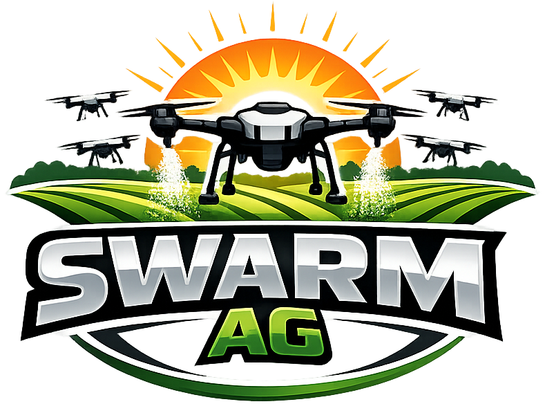

# swarmAg Operations System — Feature Parking Lot

Living document. Each entry is something real, identified in the course of other work,
that is explicitly **not** being worked on right now — deferred on purpose, not forgotten.
An entry is here because a decision is still missing, so picking it up starts with making
that decision. Do not resolve one as a drive-by fix in an unrelated session; each needs
its own scoped conversation.

Distinct from `effort/project/project-backlog.md`, which holds work already decided
and awaiting only a slot. The test is decided versus undecided — not near-term versus far.

**Format per entry:** a `**Parked:**` line carrying the date and where it surfaced, then
`**What it is:**`, `**Why parked:**`, and `**Picking this up:**`. Entries are flat and
chronological, appended as they are parked, and carry no priority — an undecided item has
nothing to order. Cite a selector, symbol, or document section — never a line number,
which rots silently.

## Equipment/Asset naming convention review

**Parked:** ~2026-05-08 — during UX foundational work (session
`2a7c772d-99ba-45e3-b6bb-c7909ba5a1f3`). _Stale: re-verify the current state of
`source/domain/abstractions/` before acting._

**What it is:** Audit `Asset` (and equipment-adjacent abstractions — drone, vehicle,
battery, attachment) in `source/domain/abstractions/` for whether identity is a
structured, human-memorable call sign (e.g. `Raven-2`, `Falcon-B`) or a free-form display
string, whether `name` fields are typed/constrained, and whether fleet identity, subsystem
identity, and maintenance identity are expressed as distinct concepts or collapsed into
one.

**Why parked:** Explicitly deferred until after UX foundational work completed. Naming is
an interface — in field operations (radios, checklists, dispatch, telemetry, crew
coordination under pressure) ambiguous identifiers create real friction. The model to
study: military aviation tail numbers/call signs, railroads, telecom — domains that solved
shared mental state under operational load.

**Picking this up:** Foundation Mode (domain meaning). An audit producing proposed domain
model changes for CA review. Do not modify domain abstractions directly without an
explicit go.

## PII retention on soft-deleted users

**Parked:** 2026-07-14 — during Edge Functions Remediation verification
(`effort/completed/2026-07-14-user-create-hang-handoff.md`).

**What it is:** `UserOrchestra.delete()`
(`source/back/supabase-edge/orchestration/user-orchestra.ts`) soft-deletes a user by
setting `deleted_at`/`updated_at` only. It never scrubs `primary_email`, `phone_number`,
`display_name`, or `notes` — full PII stays queryable in `public.users` indefinitely,
distinguished only by a timestamp flag. Auth identity revocation (`deleteAuthUser`) is
clean and complete; the domain-row PII retention is not. Confirmed live by querying a
just-"deleted" test user and getting their email back in plaintext.

**Why parked:** This is a real GDPR (Art. 17 right to erasure) / CCPA exposure question if
the business has EU or California users, but it is a legal/policy decision as much as a
code change — retention windows, what counts as a formal erasure request versus a routine
admin "delete" click, DPA obligations — not something to resolve inside an unrelated
bug-fix or feature session. Needs its own scoped conversation with explicit sign-off.

**Picking this up:** Likely Foundation Mode (touches domain meaning / data lifecycle),
starting with a decision on: (1) whether "delete" and "erase" should be distinct
operations in the UI/API, (2) what retention window (if any) applies before PII is
scrubbed, (3) whether anonymization replaces PII fields in place or the row is fully
removed once referential integrity no longer requires it.

## Eject should ban, not delete, the Auth identity

**Parked:** 2026-07-16 — during the User Manager UX rework
(`effort/completed/2026-07-16-user-manager-ux-rework-brief.md`).

**What it is:** `UserOrchestra.eject()`
(`source/back/supabase-edge/orchestration/user-orchestra.ts`) currently calls the same
`deleteAuthUser` (`auth.admin.deleteUser`) as `delete()` — fully removing the Supabase
Auth identity. Per D5 in the edge-functions remediation design doc, this makes
reactivation genuinely impossible: setting the domain row's `status` back to `active`
doesn't restore an Auth identity, because there is nothing left to restore. The correct
model is closer to a ban: `auth.admin.updateUserById(id, { ban_duration: '<long>' })`
blocks future logins/token refreshes while preserving the identity, so reinstatement is
just unbanning — no need to ever recreate an Auth user or worry about the
`auth.users.id = public.users.id` invariant.

**Why parked:** This changes eject's actual mechanism, not just a bug fix — it reopens
D4/D5's reasoning. One real unknown needs verifying before committing to the design:
whether an already-issued, not-yet-expired access token stops working immediately on ban,
or only fails on its next refresh — that determines whether "log the user out" needs
anything beyond the ban itself (e.g. an explicit session-revocation call).

**Picking this up:** Foundation Mode (reopens D4/D5). Verify Supabase's current
ban-vs-active-token behavior first, then decide whether eject and a future explicit
reinstate both live in `user-orchestra.ts` as symmetric operations, and whether the
editor's status toggle should be disabled/warned against for ejected users until
reinstatement is real.

## Lead abstraction — inbound pipeline automation

**Parked:** 2026-07-19 — CA executive decision during Phase 3 design.

**What it is:** The sales pipeline truly begins before the prospect: leads arrive via
voicemail, text, and email, and a rep transforms them into prospects for return calls. The
domain has no Lead abstraction — today this is deliberately manual: the rep checks the three
inboxes three times a day and runs the onboarding wizard when a lead has enough substance
(an email address, since User requires one and provisions auth).

**Why parked:** CA verdict — love the idea; automate it, measure it, track it, all
excellent features. Not now.

**Picking this up:** Foundation domain addition — `Lead` (source: voicemail|text|email,
captured contact fragments, service interest, status: new|contacted|converted|dead),
auth-free, cheap to create, converting into User + prospect Customer via the onboarding
wizard's stage 1 ("from lead"). Then the features the entity unlocks: inbox
integration/automation, pipeline measurement (lead→prospect conversion, response latency),
a Leads widget on the sales dashboard, and retiring the auth-identity-at-genesis wrinkle
(leads carry no login).

## Customers query API — status filter & ordering

**Parked:** 2026-07-21 — CA, during B0 close.

**What it is:** `api.Customers.list` is pagination-only (`limit`/`cursor`) and scoped to
active rows by RLS. It cannot filter by domain `status` (`prospect` vs `active`) or order
by `created_at`. M1 does not need it — the COW never lists customers (D17 stage 1 is pure
contact capture). The real consumers are downstream: the prospect hub (D15 — "prospect
list with time-since-creation") and story 1.2's sales widget, both arriving with the
assessment flow.

**Why parked:** CA verdict — the query surface lives in the shared `ApiCrudContract` /
`ListOptions` (`core/api`) plus the PostgREST translation (`core/cli`), so it is a
core-layer contract evolution, not a Customers-local add. Its shape is a deliberate
architectural decision the CA intends to design directly, in keeping with the
framework-free, minimal-dependency house standard — deferred until the hub milestone
provides a real consumer to pin requirements.

**Picking this up:** A Foundation pass on the core query contract, designed against the
hub as first consumer — not an ad-hoc filter bolted onto the topic client.

## Table header gradient seams at fractional column widths

**Parked:** 2026-07-22 — CA, during the panel decomposition.

**What it is:** Vertical lines appear between columns in a table's header row at certain
widths. They are not borders — no table cell declares an inline border anywhere, verified
by inspection. `[data-ui='table-head']` carries `background: var(--sa-table-bg-head)`
(`--sa-gradient-brand`, a 135° gradient), and that gradient is painted **per cell** rather
than once across the row group. When a column boundary lands on a whole pixel the seam is
invisible; when it lands mid-pixel it renders as a line. Reproduced in the style guide by
forcing fractional cell widths — boundaries at `.797`, `.5`, `.609` all seam; integer
boundaries do not.

Surfaced when the manager's columns moved from `2fr 1fr` to `1.7fr 1.3fr`, which was the
CA's requested 30% wider editor. That change did not cause the defect — `2fr 1fr` happened
to produce integer cell widths at common viewport sizes, so the artifact was latent, not
new.

**Why parked:** Every obvious fix collides with a deliberate decision already documented
in the sticky-header comment on `[data-ui='table-head']` in `ui.css`.
`border-collapse: separate` is load-bearing for the sticky header (in the collapsed model,
cell borders belong to the table and stay behind when the head sticks), and the head's
`clip-path` exists because neither `overflow: clip` on the table nor `border-radius`
rounds a row group. Moving the gradient to the table, to the row, or to the cells each
breaks one of those. It is cosmetic, width-dependent, and predates that session.

**Picking this up:** Foundation Mode — it is `ui.css`, the design-language layer. Start
from the sticky-header construction as a whole rather than patching the gradient onto the
current one; the constraint set (sticky head + rounded top corners + continuous gradient +
separate borders) may want a different structure rather than a fix. Do not "solve" it by
choosing `fr` values that happen to yield integer widths — that is luck, not a fix, and it
silently breaks at the next container size.

## HelmWidget header action scope

**Parked:** 2026-07-22 — CA, during dashboard HelmWidget responsive work.

**What it is:** The header HelmWidget should eventually contain only universal application
commands — for example Support, About, and Logout. This keeps the shared header compact
and keeps per-action presentation (each action's own configured `labelMode`) legible
across all applications, rather than crowding the terminal field with app-specific links.
Application-specific navigation belongs in a separate dashboard body concept, not in
HelmWidget and not in a header/body variant of it. Admin would move links such as Users
and Onboarding to that future body surface; Ops would use its own composition when it has
applicable links. Customer deliberately has no such body surface when it has no
app-specific navigation.

**Why parked:** The current header behavior is stable enough, while the body surface needs
an intentional contract and seed-composition design. It should not be introduced as an
incidental rearrangement of current links.

**Picking this up:** Foundation Mode. Define the separate body action surface, its
responsive presentation, and the app dashboard seed compositions together. Then move
Admin-only header actions to that surface and add the corresponding Ops composition only
when it has real app-specific destinations.

## Duplicate customer detection

**Parked:** 2026-09-01 — Ted, during onboarding Sites-stage bug investigation.

**What it is:** `customers` has no uniqueness constraint on anything identifying — not
`name`, not the contact email/phone buried in `primary_contact` JSONB, nothing beyond the
trivially-unique `id` every `create()` call mints fresh. The onboarding wizard has no
search-before-create step either. Nothing anywhere stops the same real-world customer from
being onboarded twice as two separate, unrelated `Customer` rows, each silently
accumulating its own sites/notes/job history.

**Why parked:** Confirmed this is not the same category of gap as `users_primary_email_unique`
— that constraint exists because email is the access mechanism (Auth/OTP identity), and one
email must resolve to exactly one login. A customer's name/contact fields play no such role;
nothing in the system keys access off them, and two distinct real customers can legitimately
share a name, so there's no field that could safely be declared unique the way email is for
users. Ted's read: not an issue at current onboarding volume/team size — parked on judgment,
not on missing information.

**Picking this up:** If it ever becomes real, the fix is soft (a search-before-create nudge —
"a customer named X already exists, is this them?"), not a hard constraint, since no natural
unique key exists for customer identity. Bias toward prevention at creation time over
building merge tooling later — reconciling two already-diverged records after the fact is a
much harder problem than catching it once at the point of entry, and most systems at any
scale never build real merge tooling once duplicates exist.

## Task-chain purity — where does a mechanical auto-fix belong

**Parked:** 2026-09-04 — surfaced fixing a recurring `.DS_Store`/`guard:leaf` annoyance,
reverted after ACE's review of an unrelated production caught the underlying question.

**What it is:** `guard:leaf` keeps failing on macOS-Finder-generated `.DS_Store` files, a
real, recurring, low-grade annoyance (Ted: "this will continue to fire guard errors — which
it should" — the detection is correct, the noise source isn't worth manual cleanup every
time). A first fix chained a `clean:ds-store` sweep directly into `guard:leaf`'s own task,
making an individual guard mutate the tree before checking it — which breaks the pattern
every other task in `deno.jsonc` follows: a mutating operation always gets an honest verb
name (`fmt`, `lock:update`, `gen:*`), never a `check`/`guard` name. Reverted once named.

The broader question the specific case sits inside: **should `check`/`check:guards`
orchestration ever mutate**, as a convenience, even though the individual `guard:*` units
it composes stay strictly pure? `.DS_Store` deletion seems safe either way — no context
ever wants to _know_ about a stray `.DS_Store`, so removing it loses no information. Auto-
running `fmt` (not just `fmt:check`) at the same orchestration level is a sharper version of
the same question, raised in the same conversation — reformatting **is** meaningful
information (a real diff), so silently applying it inside something named `check` could let
a future strict/CI use of that name mean "the repo, after being quietly rewritten, is
correct" rather than "the repo, as committed, is correct."

**Amended (2026-09-04, same sitting):** the proposed seam for this — splitting `chk` (bare
alias for `check`, created only to match `fmt`'s three-letter brevity for fast typing) into
a deliberately-mutating convenience path — is gone as an option. Ted removed `chk` from
`deno.jsonc` entirely rather than give it its own behavior: a second, non-standardly-named
command sitting next to the fully-spelled `check` broke the consistency of an otherwise
clean `verb`/`verb:noun` task surface, and that problem outranked the convenience. No
`chk`-shaped seam exists anymore to hang a split on. The underlying question — does `fmt`
(mutating) or the `.DS_Store` sweep belong chained into `check`/`check:guards` itself, given
`check` is now the only name in play — is still open and narrower than before.

**Why parked:** A real devops/task-architecture decision, not a drive-by fix — deserves its
own pass rather than being resolved as a side effect of an unrelated onboarding production.

**Picking this up:** With no `chk` alias to split behavior onto, decide per mutation —
`.DS_Store` sweep and `fmt` are the two concrete candidates already on the table — whether
either belongs chained into `check`/`check:guards` at all, or stays a separate, deliberately
typed step. Until then, `.DS_Store` is `rmdir`-by-hand when `guard:leaf` reports it.

_End of Feature Parking Lot Document_
