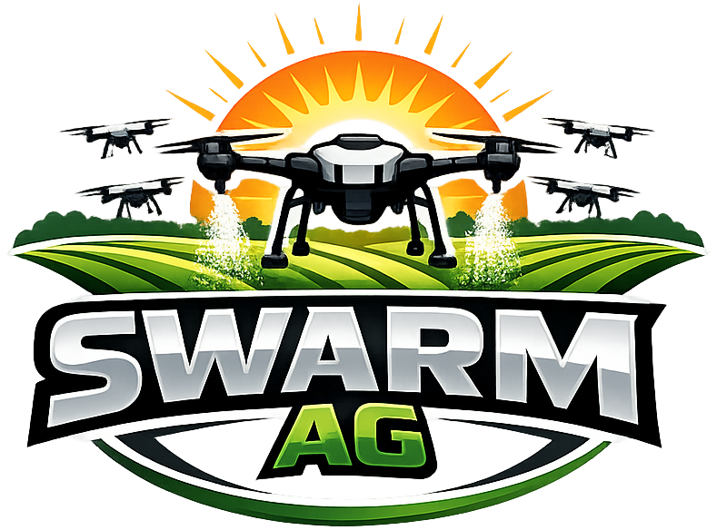

# swarmAg Operations System — Roadmap

The intended execution sequence for decided work — see `EFFORT.md` §3 for what this document
is and how it relates to the backlog and parking lot.

**Format per entry:** what it comprises, why it sits where it does, and what backlog items
block or ride with it. An entry marked **(open)** has no settled position yet — stated as open
rather than guessed at.

## 1. Users & Customers Vertical Slice

- **User Manager** (`project-user-stories.md` §6) → generalized `AbstractionManager`.
- **Onboarding Wizard** (§1.1's "Prospect genesis") → generalized `Wizard`.

Users and Customers stand as this project's **reference implementations** for Abstractions meant to be copied for the remaining ~80% of the app, not iterated on again in their own right. Onboarding wizard is the reference implementation for complex ux workflows.

Positioned first because it's the origin of the reusable archetypes, not because it closes first — it stays open until the dependencies below land, which puts its actual closure after §6:

1. Notes Editor completed & integrated into User Manager
2. Notes Editor integrated with Customer Manager feature completion
3. **(open)** Additional-contact assignment (`project-user-stories.md` §1.1): build it before §5,
   or move it to a later milestone (`EFFORT.md` §7). Until decided, it blocks closing this slice.
4. Onboarding's Initial Job Assessment stage, which needs §6: the Onboarding Wizard cannot finish
   before Services, Workflows, and seeding exist.

## 2. Shell/App Split — Closed 2026-09-21

`ux/shell/` split into `ux/shell/` and `front/app/`; CA then promoted `ux/` itself to a
top-level `source/ux/` namespace with its own `@ux/` import alias, sibling to `front/` rather
than nested under it — the literal conclusion of treating `ux/` as a third-party library.
`effort/completed/2026-09-15-shell-app-split-brief.md`.

## 3. Customer Manager — Closed 2026-09-30

Post-genesis Customer editing through `AbstractionManager`, reusing Onboarding's Customer steps.
Both workbenches now host a sequence of one or more steps over one shared `panel/` step contract.
`effort/completed/2026-09-22-customer-manager-brief.md`.

It does not close the Users & Customers slice (§1). Additional-contact assignment
(`project-user-stories.md` §1.1) is not built and has no slot yet.

## 4. Notes Editor

Stock, parameterized Index-Detail archetype `NotesEditor`, lands in `front/app/shell/`. It is
an application feature, not toolkit, so it belongs in `front/app/`, not `ux/`. It is built for
inclusion in a workbench archetype, which rules out other surfaces such as a simple popup
dialog.

Two capabilities, each landing with the milestone that first needs it:

- **Attachments** — with §5 Mechanical Productions, for operator and maintenance documents on
  assets.
- **Device media recording** — with onsite Job Assessment (§7). Assessment, planning, and
  running all need it.

**Tags:** decided 2026-10-06. There is no tag capability: `Note.tags` is removed, and Service and
Workflow classification moves to curated facets. The Notes Editor shows no tags.

**Sequence:**

1. **Tags → facets** — completed 2026-10-08: `effort/completed/2026-10-06-tags-classification-brief.md`.
2. **Notes Editor brief** — completed 2026-10-08: `effort/completed/2026-10-08-notes-editor-brief.md`.
3. **Notes Editor production** — shipped 2026-10-08 (`991bc90`), with the brief.
4. **Milestone verification,** this milestone, then §1.

Rode with it, delivered 2026-10-08: User Manager consumes it, so User Management is closed; the
Sites step's local `NoteEditor` and User Manager's flattening text area are replaced; Customer
account notes are editable (the backlog entry "Customer Manager cannot edit account-level notes",
now removed).

## 5. Mechanical Productions

Standard production from the Users/Customers reference implementations — no design conversation
needed, pick up whenever convenient once §2 lands. Named "Asset Manager"/"Chemical Manager" here
deliberately, not "Maintenance": that's `project-user-stories.md` §3/§4's own theme name, but it
describes a larger destination (schedules, inventories, parts — parking lot: "Equipment & Chemical
Maintenance Workbench") than the stock CRUD shipping first. A `project-user-stories.md` iteration
rides with this milestone, once §1 is closed, to scope both themes properly before that fuller
work is picked up:

- **Asset Manager** (`project-user-stories.md` §3.1–3.2) — Manager, wire `api.Assets`.
- **Chemical Manager** (`project-user-stories.md` §4) — Manager, wire `api.Chemicals`.

## 6. Workflow, Task, Question & Service

`project-user-stories.md` §5, currently unwritten, plus `Service` (domain type exists, `api.Services` commented out). Needs the Workflow Builder archetype — named in `architecture-front.md`'s normative tree (`workflow-builder/`) but never built. The one theme with no existing archetype to extend at all, and the most depended-upon: Job Definition's own §2.1 "workflow seeding" (preload a default workflow per Service/SKU) can't be built until this exists.

Seeding filters the Workflow library by the selected Services' facets, and the rep chooses from the
result. Design input, including the open questions on facet values, curation, and Service versus
Service Category: `effort/pending/2026-10-06-facets-workflow-seeding-brief.md`.

## 7. Job Definition

Admin-side (`project-user-stories.md` §2.1–2.6, 2.9): service selection through assessment,
planning, finalization, and followup. Backlog: "Onboarding — Initial Job Assessment stage"
(`normal`) covers §2.1 specifically. Needs `api.Jobs` wired (currently commented out in
`api.ts` — not itself a backlog entry, a real gap) and depends on §6 above for Service/Workflow
seeding.

Rides with it: backlog "A Customer with Jobs can be deleted" (`normal`) — the first Job that
references a Customer is where the delete guard lands.

## 8. Job Runner

Ops-side (§2.7–2.8): offline field execution. `architecture-front.md`'s normative tree already
names `job-runner/` as its own directory, distinct from `job-assessment/`/`job-planning/` —
the architecture anticipated this as a separate concern, not a sub-case of Job Definition.

**Not a synchronization problem — the architecture already ruled that out.**
`architecture-core.md` §9 and invariant §10.1.5 already decide this: Job Plan is locked/immutable
the moment execution starts, `JobWorkLogEntry` is append-only, and log upload is explicitly "not
synchronization — a one-way append operation." No conflict resolution, no last-write-wins, no
distributed transaction coordination — the design deliberately avoids needing any of that. What's
actually missing is implementation of that already-decided pattern: `api.deepCloneJob`, the local
clients (`JobsLocal`/`JobAssessmentsLocal`/`JobPlansLocal`/`JobLogsLocal`), and
`api.uploadJobLogs` — none built yet, but none requiring a design decision either. This is Job
Runner's own prerequisite plumbing, not a separate milestone with its own feature payload.

## 9. Dashboard Widget Development

Shared widget catalog plus per-app instances — specialization direction, building diverse
content atop already-generalized primitives (contrast with §2's generalization direction).
Houses:

- **ux/ui/charts** - 4 chart types available to dashboard widgets
- **Hub widget** (backlog, `normal`) — primary approach for grouping dashboard commands by
  topic; hierarchical left-nav panel is the named fallback if it doesn't prove out. Job's three
  independently-tabled phases are its clearest motivating case, so this milestone likely follows
  real Job data existing (Job Definition/Job Runner), not precede it.
- **Prospect Pipeline Visibility** (§1.2) — a prospects-by-age widget plus aging charts, buildable
  off `Customer.status = 'prospect'` alone. The simplest entry in this milestone: no new
  archetype needed, doesn't depend on the parked `Lead` abstraction.

## Orthogonal to project themes

Features not belonging to any theme are added to whatever session happens to touch its territory.

- **DevOps hygiene** — "`source/devops/` is not held to CONVENTIONS" (`normal`) bundled with
  "`edge-deploy` lacks the target-resolution and verification parity `app-deploy.sh` already
  has" (`high`) — same territory, same session.
- **Doc hygiene** — "`architecture-core.md` is base context and has never been measured for scan
  cost" (`high`), "`architecture-devops.md` buries what an agent scan needs" (`normal`).
- **Guard gaps** — "`guard:css` does not verify that a referenced token resolves" (`normal`),
  "`guard:leaf` does not sweep the repository root" (`normal`), "No guard enforces conformity to
  established conventions" (`low`).
- **Shared UI controls do not use one state model** (`high`) — rides with no milestone for now.
  Real and fully scoped, but not assigned to any of the above; pick up on its own schedule.
- **Collection-Detail surfaces do not draw the Selection** (`normal`) — small UX gap on every
  shipped and future `AbstractionManager` above its container threshold.
- **Auth bundle** — "A stale session survives genesis..." and "Eject should ban, not delete..."
  (both `normal`, downgraded/bundled 2026-09-12 — see backlog for why), sharing one unresolved
  verification with the DevOps `edge-deploy` entry above.
- **Login needs an "Already have a code?" action** (`normal`).
- **Testing** — not a slot, a practice change: every milestone from here forward scopes its own
  test coverage as part of its own brief, rather than shipping and being driven-and-reported
  afterward. `CONVENTIONS.md` §12's convention only covers domain/adapter/API today; extending it
  to the UX layer is foundation work belonging with whichever milestone needs it first (most
  likely §2 or §3).
- **Style guide into `ux/`** — "`app-style-guide` belongs in `ux/`, not `front/`" (`low`).
  Unblocked now that the Customer Manager production has landed.
- **Managers load only the first page of their Collection** (`normal`) — one shared fix for User
  Manager and Customer Manager, not one per manager.

_End of Roadmap Document_
